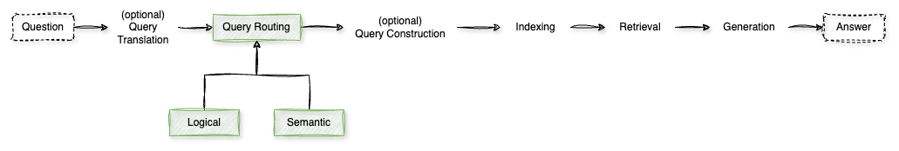

# Routing

In **Retrieval-Augmented Generation (RAG)** systems, the **routing** step is crucial for directing user queries to the most appropriate data sources or processing modules, enhancing the relevance and accuracy of the generated responses. Effective routing ensures that each query is handled by the component best suited to address its specific requirements.

**1. Logical Routing**

Logical routing involves directing queries based on predefined rules or characteristics, such as keywords, query length, or specific patterns. This method relies on explicit criteria to determine the appropriate data source or processing pathway.

*Example*:
- A query containing the keyword "Python" might be routed to a database of Python programming documentation.

[Notebook](./1%20-%20Logical.ipynb)

**2. Semantic Routing**

Semantic routing utilizes the meaning and context of a query to determine its destination. By analyzing the semantic content, the system can match the query to the most relevant data source or expert model.

*Example*:
- A query about "investment strategies" would be semantically routed to financial data sources, even if it doesn't contain specific predefined keywords.

[Notebook](./2%20-%20Semantic.ipynb)

**Advanced Routing Techniques**

Beyond logical and semantic routing, several advanced techniques enhance the routing process in RAG systems:

**3. LLM-Based Classification**

This technique employs a separate Large Language Model (LLM) trained to classify user queries into specific domains or categories. Once classified, the query is routed to the corresponding sub-model or data source tailored for that domain.

*Example*:
- A query is classified as related to "healthcare," prompting the system to route it to medical databases and models specialized in healthcare information.

> **TODO**: Create the notebook

**4. Hybrid Routing**

Hybrid routing combines multiple routing strategies to leverage their respective strengths. For instance, it may integrate logical rules with semantic analysis to achieve more accurate routing decisions.

*Example*:
- A system first applies logical routing based on explicit keywords and then refines the routing decision using semantic similarity measures to ensure the query reaches the optimal destination.

> **TODO**: Create the notebook

**5. Contextual Routing**

Contextual routing considers the user's interaction history and contextual information to make routing decisions. By understanding the broader context of a user's queries, the system can provide more personalized and relevant responses.

*Example*:
- If a user has been asking about web development, a new query about "best frameworks" would be routed to web development resources, interpreting "frameworks" in the context of previous interactions.

> **TODO**: Create the notebook
 
**6. Dynamic Routing with LLMs**

Advanced RAG systems can incorporate LLMs to dynamically decide the most suitable processing path for a query. The LLM evaluates the query's complexity and context to determine whether to handle it directly or route it to a specialized module.

*Example*:
- A straightforward factual query might be answered directly by the LLM, while a complex, domain-specific question could be routed to a specialized expert system for a more detailed response.

> **TODO**: Create the notebook

Implementing these routing techniques enhances the efficiency and effectiveness of RAG systems, ensuring that user queries are addressed by the most appropriate resources, leading to more accurate and contextually relevant responses. 