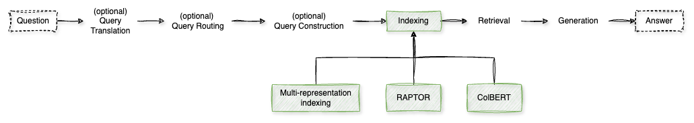

# Indexing

In **Retrieval-Augmented Generation (RAG)** systems, the **indexing** step is crucial for organizing and representing documents to facilitate efficient and accurate retrieval. Advanced indexing techniques enhance the system's ability to handle complex queries and large datasets. Here are some notable methods:

**1. Multi-Representation Indexing**

This technique involves creating multiple representations for each document, capturing various aspects such as keywords, semantic embeddings, and visual features. By doing so, the system can adapt to diverse document types and user needs, improving retrieval accuracy and flexibility.

*Example*:
- A research paper might be indexed by its abstract (textual analysis), topic modeling (semantic embedding), and associated diagrams (visual features).

[Notebook](./1%20-%20Multi-representation%20Indexing.ipynb)

**2. RAPTOR (Recursive Abstractive Processing for Tree-Organized Retrieval)**

RAPTOR constructs a hierarchical tree of document summaries at varying abstraction levels. It recursively embeds, clusters, and summarizes text chunks, enabling efficient retrieval across different scales of information granularity. This method captures both thematic comprehension and detailed content, enhancing retrieval performance.

*Example*:
- A book is broken down into chapters, sections, and paragraphs, each summarized and organized hierarchically. A query can then retrieve information from the most relevant level of detail.

[Notebook](./2%20-%20RAPTOR.ipynb)

**3. ColBERT (Contextualized Late Interaction over BERT)**

ColBERT is a retrieval model that enables scalable BERT-based search over large collections. It encodes each passage into a matrix of token-level embeddings and matches queries to passages based on context using scalable vector-similarity operators. This approach balances retrieval speed and accuracy by precomputing document embeddings and performing late interaction during retrieval.

*Example*:
- A user searches for "climate change impacts." ColBERT retrieves passages where the context of "impacts" closely relates to "climate change," even if the exact phrase isn't present.

[Notebook](./3%20-%20ColBERT.ipynb)

**4. SiReRAG (Indexing Similar and Related Information for Multihop Reasoning)**

SiReRAG focuses on organizing data to support complex, multihop reasoning tasks. It enhances retrieval by adding synthesized information, such as recursive summaries, to text chunks, demonstrating significant performance improvements in complex question-answering scenarios.

*Example*:
- To answer a question requiring information from multiple documents, SiReRAG indexes related documents together, facilitating efficient retrieval of all necessary information.

> **TODO**: create notebook

**5. Hybrid Indexing Strategies**

Combining multiple indexing methods can further enhance retrieval performance. For instance, integrating multi-vector indexing with parent document retrieval balances the granularity of information and context integrity, improving the system's ability to handle diverse query types.

*Example*:
- A legal document is indexed both by individual sections (multi-vector indexing) and as a whole (parent document retrieval), allowing retrieval of specific clauses or the entire document based on the query.

> **TODO**: create notebook

Implementing these advanced indexing techniques enables RAG systems to efficiently manage and retrieve information from large, complex datasets, leading to more accurate and contextually relevant responses. 