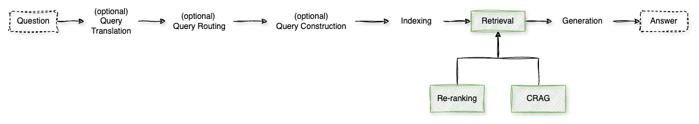

# Retrieval

In **Retrieval-Augmented Generation (RAG)** systems, the **retrieval step** is crucial for fetching relevant information to support accurate and contextually appropriate responses. Advanced retrieval techniques have been developed to enhance this process, including **re-ranking**, **Corrective Retrieval-Augmented Generation (CRAG)**, and **Self-Reflective Retrieval-Augmented Generation (Self-RAG)**.

**1. Re-ranking**

Re-ranking involves initially retrieving a set of documents based on their relevance to a query and then reordering them to prioritize the most pertinent information. This process enhances the accuracy and relevance of the results obtained during the retrieval step.

*How It Works:*

- **Initial Retrieval:** A broad set of documents is retrieved using basic relevance metrics.
- **Scoring:** Each document is evaluated using more sophisticated models or criteria to assess its relevance more precisely.
- **Re-ordering:** Documents are reordered based on their new relevance scores, with the most relevant ones placed at the top.

*Benefits:*

- **Improved Accuracy:** Ensures that the most relevant documents are prioritized, enhancing the quality of the generated responses.
- **Efficiency:** Reduces the need for the model to process less relevant information, streamlining the generation process.

[Notebook](./1%20-%20Re-ranking.ipynb)

**2. Corrective Retrieval-Augmented Generation (CRAG)**

CRAG enhances the robustness of RAG systems by evaluating the quality of retrieved documents and taking corrective actions when necessary. It incorporates self-assessment mechanisms to improve the accuracy and relevance of generated responses.

*How It Works:*

- **Retrieval Evaluation:** A lightweight evaluator assesses the quality of retrieved documents, assigning confidence scores to determine their reliability.
- **Knowledge Refinement:** If the confidence in the retrieved documents is low, the system employs strategies like web searches or decomposition algorithms to refine the information.
- **Generation:** The refined, high-confidence information is used to generate accurate and contextually appropriate responses.

*Benefits:*

- **Enhanced Reliability:** Reduces the likelihood of inaccuracies by ensuring only high-quality information is used in generation.
- **Adaptability:** Can seamlessly integrate with various RAG-based approaches to improve performance across different tasks.

[Notebook](./2%20-%20CRAG.ipynb)

**3. Self-Reflective Retrieval-Augmented Generation (Self-RAG)**

Self-RAG enables language models to adaptively decide when to retrieve external information and to critique their own outputs, enhancing both quality and factuality.

*How It Works:*

- **Adaptive Retrieval:** The model determines the necessity of retrieval based on the query and retrieves information on-demand, allowing for multiple retrievals or skipping retrieval when appropriate.
- **Generation:** Utilizes retrieved passages to generate responses, integrating external knowledge as needed.
- **Self-Critique:** The model reflects on its own generation, using special tokens to critique and refine the output, ensuring higher accuracy and relevance.

*Benefits:*

- **Improved Factuality:** By retrieving information as needed and critiquing its own outputs, the model reduces the likelihood of generating incorrect or irrelevant responses.
- **Versatility:** Adapts to diverse task requirements, tailoring its behavior to provide the most appropriate responses based on the context.

[Notebook](./3%20-%20Self-RAG.ipynb)

**4. SeaKR (Self-aware Knowledge Retrieval)**

SeaKR introduces self-awareness into the retrieval process, allowing the model to assess its own uncertainty and decide when retrieval is necessary.

*How It Works:*

- **Uncertainty Assessment:** The model evaluates its own confidence in generating a response.
- **Adaptive Retrieval:** If uncertainty is high, the model triggers a retrieval process to obtain relevant knowledge snippets.
- **Re-ranking:** Retrieved snippets are re-ranked based on their potential to reduce the model's uncertainty, ensuring the most helpful information is utilized.

*Benefits:*

- **Enhanced Accuracy:** By retrieving information when needed, the model can provide more accurate and contextually appropriate responses.
- **Efficient Reasoning:** Adapts its reasoning strategies based on the complexity of the task, improving performance on both simple and complex queries.

> **TODO**: Create notebook

Implementing these advanced retrieval techniques enables RAG systems to provide more accurate, contextually relevant, and reliable responses, enhancing the overall performance of language models in various applications. 