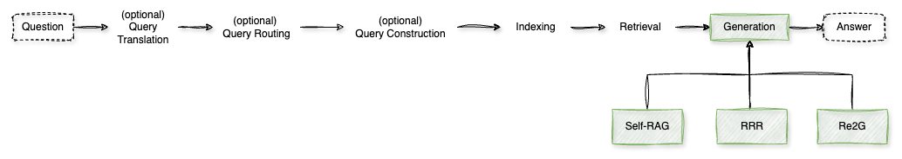

# Generation

In the **generation step** of RAG, advanced techniques have been developed to enhance the quality, accuracy, and relevance of generated content.

**1. Self-Reflective Retrieval-Augmented Generation (Self-RAG)**

Self-RAG enhances an LLM's output by enabling it to:

- **Adaptively Retrieve Information:** The model determines when external information is necessary and retrieves relevant passages on-demand.
- **Generate Responses:** It integrates retrieved information with its internal knowledge to produce coherent and contextually appropriate outputs.
- **Self-Reflect:** The model critiques its own responses using special tokens, allowing it to assess and improve the quality and factuality of its outputs.

*Benefits:*

- **Enhanced Factuality:** By retrieving up-to-date information and self-critiquing, the model reduces inaccuracies and hallucinations.
- **Versatility:** The self-reflection mechanism enables the model to tailor its behavior to diverse task requirements, improving performance across various applications.

[Notebook](./1%20-%20Self-RAG.ipynb)

**2. Rewrite-Retrieve-Read (RRR)**

RRR is a framework that enhances text generation by refining the input query before retrieval and reading, improving the quality of retrieved information and the accuracy of the generated outputs.

*How It Works:*

- **Rewrite:** A small language model rewrites the initial query to better align with the retrieval system, bridging the gap between the input text and the needed knowledge.
- **Retrieve:** The refined query is used to retrieve a set of relevant documents or passages related to the input.
- **Read:** The LLM reads the retrieved documents to generate responses, integrating external knowledge to produce accurate and contextually appropriate outputs.

*Benefits:*

- **Improved Relevance:** The query rewriting step ensures that the retrieval process yields more pertinent information, enhancing the quality of the output.
- **Efficiency:** By focusing on well-aligned queries, the model reduces the processing of less relevant information, streamlining the generation process.

[Notebook](./2%20-%20RRR.ipynb)

**3. Retrieve, Rerank, Generate (Re2G)**

Re2G is a framework that enhances text generation by incorporating a retrieval and reranking process before the generation step.

*How It Works:*

- **Retrieve:** The system retrieves a set of relevant documents or passages related to the input query.
- **Rerank:** The retrieved documents are reranked based on their relevance and quality, ensuring that the most pertinent information is prioritized.
- **Generate:** The model generates responses by leveraging the top-ranked documents, integrating external knowledge to produce accurate and contextually appropriate outputs.

*Benefits:*

- **Improved Relevance:** The reranking step ensures that the most relevant information is utilized during generation, enhancing the quality of the output.
- **Efficiency:** By focusing on top-ranked documents, the model reduces the processing of less relevant information, streamlining the generation process.

[Notebook](./3%20-%20Re2G.ipynb)

